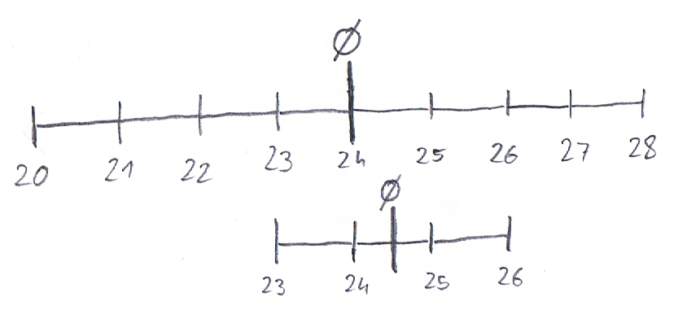
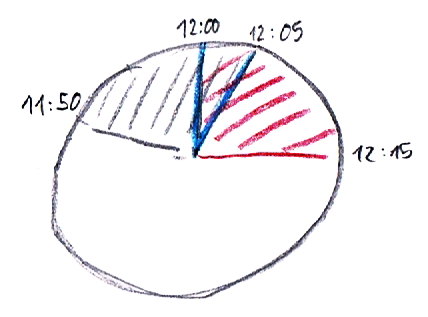
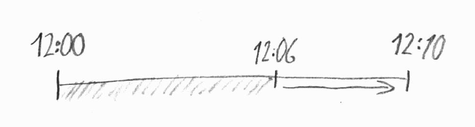

<h1 align="center"> Supplementary material to:  Sketching Temporal Uncertainty - An Exploratory User Study </h1>

Fabian Schwarzinger1, Andreas Roschal1, and Theresia Gschwandtner1 1TU Wien, Austria

This is supplementary material to our work, in which we present an exploratory user study. Our 32 participants were provided with three scenario descriptions each and were asked to visually present the given information. They sketched their spontaneous visualization designs with pen and paper and verbally described how they imagine their designs to work in practice. 

The following pages contain all collected sketches, as well as some additional information about the corresponding participants. Together with each participant we estimated their average computer usage in comparison to others and rated it from 1(low) – 5(high). We did the same for their experience with information visualization. These ratings are just rough estimations. Furthermore, non of the participants are information visualization experts, hence the highest rating in this category means that the corresponding participants partook in an university course about InfoVis, but did put particular focus on this topic. 

To make it easier to compare the drawings to the corresponding scenario, we recap on the four scenarios we posed to each participant:

1. Bus scenario –  ’A bus should arrive at 12:00, but may be running late for up to 10 minutes. How would you visualize this scenario, so that you can estimate the probability of still catching the bus if you arrive at the bus station at a given point in time?’

1. Project scenario (1/2) – ’There are two possible approaches to a given project. The first approach will take 20 to 28 days, while the second one will take 23 to 26 days. How would you visualize the scenario, so you can effectively judge which of the two approaches will on average lead to an earlier completion of the project?’

1. Project scenario (2/2) –  ’Consider the same two project approaches as before and an additional given point in time. How would you visualize the scenario, so you can effectively gauge which approach is more likely to have finished until the given point in time?’ This scenario and the previous one are collectively referred to as the project scenario.

1. Lecture scenario – ’Two lectures are taking place after each other. The first lecture will end between 11:50 and 12:05, while the second lecture will start between 12:00 and 12:15. How would you visualize this scenario to be able to judge the probability of an overlap of the two lectures? Furthermore, it should be possible to accurately judge the interval in which an overlap can take place.’

<table>
  <tr>
    <td><b>Bus scenario</b></td>
    <td><b>Project scenario</b></td>
    <td><b>Lecture scenario</b></td>
  </tr>
  <tr>
    <td colspan="3"><b>Participant 1</b> Computer experience:3 InfoVis experience:2</td>
  </tr>
  <tr>
    <td></td>
    <td></td>
    <td></td>
  </tr>
  <tr>
    <td colspan="3"><b>Participant 2</b> Computer experience:5 InfoVis experience:4</td>
  </tr>
  <tr>
    <td></td>
    <td></td>
    <td></td>
  </tr>
  <tr>
    <td colspan="3"><b>Participant 3</b> Computer experience:1 InfoVis experience:1</td>
  </tr>
  <tr>
    <td></td>
    <td></td>
    <td></td>
  </tr>
  <tr>
    <td colspan="3"><b>Participant 4</b> Computer experience:1 InfoVis experience:1</td>
  </tr>
  <tr>
    <td colspan="3">This participant did not provide any sketches.</td>
  </tr>
  <tr>
    <td colspan="3"><b>Participant 5</b> Computer experience:5 InfoVis experience:4</td>
  </tr>
  <tr>
    <td></td>
    <td></td>
    <td></td>
  </tr>
  <tr>
    <td colspan="3"><b>Participant 6</b> Computer experience:3 InfoVis experience:2</td>
  </tr>
  <tr>
    <td></td>
    <td></td>
    <td></td>
  </tr>
  <tr>
    <td colspan="3"><b>Participant 7</b> Computer experience:1 InfoVis experience:1</td>
  </tr>
  <tr>
    <td></td>
    <td></td>
    <td></td>
  </tr>
  <tr>
    <td colspan="3"><b>Participant 8</b> Computer experience:3 InfoVis experience:3</td>
  </tr>
  <tr>
    <td></td>
    <td></td>
    <td></td>
  </tr>
  <tr>
    <td colspan="3"><b>Participant 9</b> Computer experience:3 InfoVis experience:3</td>
  </tr>
  <tr>
    <td></td>
    <td></td>
    <td></td>
  </tr>
  <tr>
    <td colspan="3"><b>Participant 10</b> Computer experience:5 InfoVis experience:5</td>
  </tr>
  <tr>
    <td></td>
    <td></td>
    <td></td>
  </tr>
  <tr>
    <td colspan="3"><b>Participant 11</b> Computer experience:3 InfoVis experience:1</td>
  </tr>
  <tr>
    <td></td>
    <td></td>
    <td></td>
  </tr>
  <tr>
    <td colspan="3"><b>Participant 12</b> Computer experience:5 InfoVis experience:1</td>
  </tr>
  <tr>
    <td></td>
    <td></td>
    <td></td>
  </tr>
  <tr>
    <td colspan="3"><b>Participant 13</b> Computer experience:5 InfoVis experience:3</td>
  </tr>
  <tr>
    <td></td>
    <td></td>
    <td></td>
  </tr>
  <tr>
    <td colspan="3"><b>Participant 14</b> Computer experience:1 InfoVis experience:1</td>
  </tr>
  <tr>
    <td></td>
    <td></td>
    <td></td>
  </tr>
</table>

